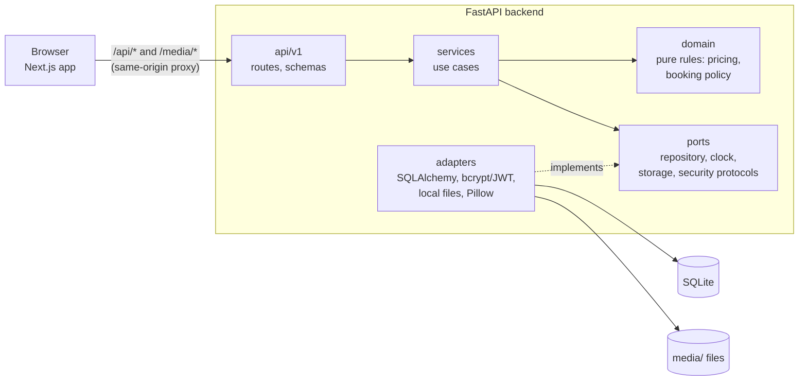
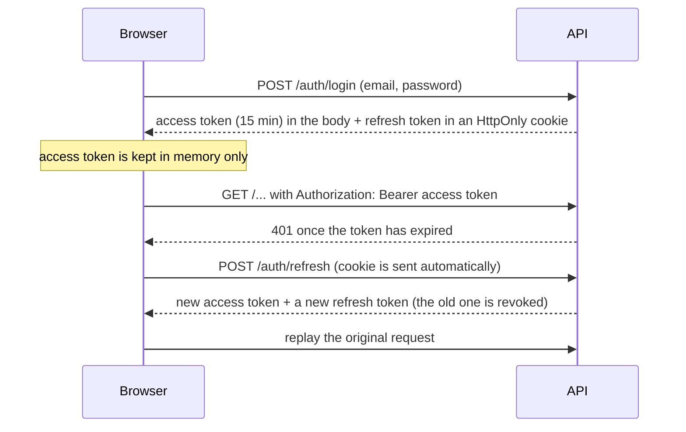
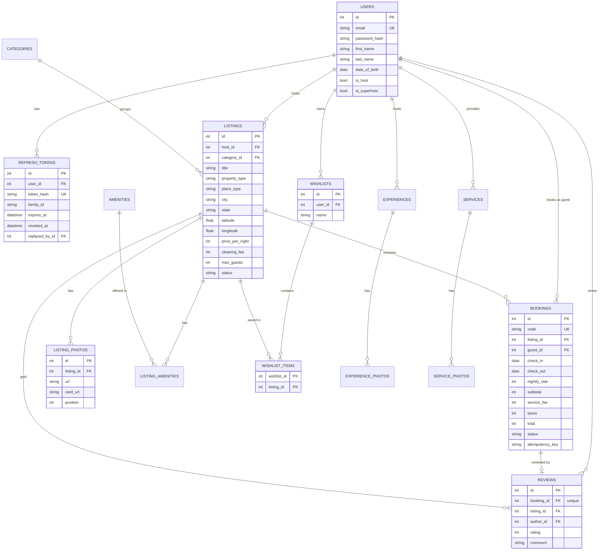

# Airbnb Clone

A full-stack clone of Airbnb for learning: browse and search stays across India, check availability and book date ranges, manage trips and wishlists, and host your own listings. The look, layout and routes follow the current airbnb.co.in. All prices are in INR, all places are in India, and all photos are stored in this repository.

> This is an educational project. "Airbnb" and its logo belong to Airbnb, Inc. Payments are mocked: nothing is charged and no card details are stored.

## Features

**Guests**
- Home with Airbnb's four tabs (All, Homes, Experiences, Services), each with its own route and search bar
- Search by place, dates and guests; Filters dialog (price histogram with slider, rooms, property type, amenities, Superhost, Guest favourite) with a live "Show N places" count; category bar; sorting
- Results as a list beside a map with price pins; infinite scroll in pages of 24
- Stay page: photo gallery, amenities, availability calendar with booked nights greyed out, ratings and reviews, host card, location map, house rules
- Booking: server-calculated price breakdown, checkout with card or UPI (validated in the browser only), confirmation code, trips (upcoming, past, cancelled), cancellation and reviews
- Wishlists: save to a named wishlist, wishlist pages
- Login and signup with real JWT authentication; dark mode

**Hosts**
- 13-step "Airbnb your home" wizard with drag-and-drop photo upload and a draggable map pin
- Listing editor, publish and unlist, delete (only when the listing was never booked)
- Dashboard: today's reservations, listings table, all reservations, earnings

**Also included:** browse-only Experiences and Services catalogues, and placeholder "coming soon" pages for the parts of Airbnb that are out of scope (messages, help centre, gift cards and so on).

## Tech stack

| Layer | Technology |
|---|---|
| Frontend | Next.js 16 (App Router), React 19, TypeScript (strict), Tailwind CSS v4, Zustand, react-hook-form + zod, react-day-picker, Leaflet |
| Backend | Python 3.11+, FastAPI, SQLAlchemy 2, Alembic, Pydantic v2, slowapi (rate limits) |
| Auth | JWT access tokens + rotating refresh tokens (HttpOnly cookie), bcrypt |
| Database | SQLite (WAL mode, foreign keys enforced) |
| Quality | pytest, vitest, ruff, import-linter (architecture contracts), ESLint, GitHub Actions |

## Quick start

Requires **Python 3.11+**, **Node.js 20+** and, on Windows, **Git for Windows**. From the repo root:

```bash
./start.sh        # macOS / Linux / Git Bash
```

```powershell
.\start.cmd       # Windows PowerShell or cmd
```

On the first run it creates the virtualenv, installs the backend and frontend dependencies, creates the `.env` files from the examples, applies the migrations and seeds the demo data. Then it starts both servers:

- App: http://localhost:3000
- API docs: http://localhost:8000/api/docs

Press `Ctrl+C` to stop both. Use `--skip-install` to skip the dependency check, and `BACKEND_PORT` / `FRONTEND_PORT` to change the ports.

## Demo accounts

Every account uses the password `Password123`.

| Email | Who | Notes |
|---|---|---|
| `guest@example.com` | Kabir Singh | Guest with upcoming and past trips and two wishlists |
| `host@example.com` | Aarav Mehta | Superhost with listings in Goa and Mumbai |
| `priya.nair@example.com` | Priya Nair | Superhost with listings in Kerala |
| `rohan.sharma@example.com`, `ananya.iyer@example.com`, `vikram.rathore@example.com`, `meera.kapoor@example.com` | Hosts | Listings across the other destinations |
| `ishita.reddy@example.com`, `arjun.patel@example.com`, `sneha.gupta@example.com` | Guests | Authors of the seeded reviews |

The seed creates 58 listings across 20 Indian destinations, plus bookings, reviews, wishlists, 26 experiences and 20 services. It is deterministic, so every clone gets the same data. Any logged-in user can also become a host from "Airbnb your home".

## Manual setup

### Backend (http://localhost:8000)

```bash
cd backend
python -m venv .venv
.venv/Scripts/activate        # Windows; on macOS/Linux: source .venv/bin/activate
pip install -e ".[dev]"
cp .env.example .env
python -m alembic upgrade head   # create the schema
python -m app.seed               # demo data (safe to repeat; --reset rebuilds it)
uvicorn app.main:create_app --factory --reload --no-access-log --no-proxy-headers
```

API docs: http://localhost:8000/api/docs · Health: http://localhost:8000/api/v1/health

### Frontend (http://localhost:3000)

```bash
cd frontend
npm install
cp .env.example .env.local
npm run dev
```

The frontend proxies `/api/*` and `/media/*` to the backend (`API_ORIGIN`, default `http://localhost:8000`), so the browser only ever talks to one origin and the refresh cookie stays first-party.

### Checks

```bash
# backend (from backend/)
ruff check . && ruff format --check . && lint-imports && pytest
# frontend (from frontend/)
npm run lint && npm run typecheck && npm test && npm run build
```

The same commands run in GitHub Actions on every push and pull request.

## Architecture



The backend follows ports and adapters (hexagonal) so each layer has one job and depends only on abstractions:

- `domain/` holds entities, enums and the rules (pricing, booking policy, listing rules). It imports nothing from frameworks or the database.
- `ports/` defines the interfaces (repositories, unit of work, clock, storage, password hashing, tokens).
- `services/` implement the use cases against those ports.
- `adapters/` implement the ports: SQLAlchemy repositories, readers for the query side, bcrypt and PyJWT, local file storage.
- `api/v1/` is the HTTP layer. `core/container.py` is the single place where the pieces are wired together.

Reads and writes are separate: writes go through entities and repositories, while read endpoints use reader classes that return Pydantic read models directly. Four import-linter contracts enforce the dependency rules in CI (domain stays pure, services never import adapters, ports stay abstract, the API never touches adapters directly).

Notable decisions:

- **No double bookings.** Stays are half-open intervals `[check_in, check_out)`, so a guest can check in on another's check-out day. The overlap check and the insert run inside one `BEGIN IMMEDIATE` transaction, which takes SQLite's write lock.
- **The server owns prices.** The browser never does price arithmetic: it asks `POST /listings/{id}/quote`. A booking stores a snapshot of every price line, so later edits to a listing never change past trips. Money is whole rupees (integers), rounded half-up.
- **Safe retries.** `POST /bookings` accepts an `Idempotency-Key`; a retry with the same key returns the original booking instead of creating a second one.
- **Bookings are never deleted.** A listing that has ever been booked cannot be deleted (409 `LISTING_HAS_BOOKINGS`); the host unlists it instead.
- **Predictable errors.** Every error is `{ "detail": "...", "code": "SOME_CODE" }`.

## Authentication



- Access tokens are short-lived JWTs (HS256) that live only in JavaScript memory, never in `localStorage`.
- The refresh token is random, stored only as a SHA-256 hash, sent in an `HttpOnly`, `SameSite=Lax` cookie scoped to `/api/v1/auth`, and **rotated on every use**. If an already-used refresh token is presented again, the whole token family is revoked.
- After a page reload the refresh cookie restores the session. Only one refresh runs at a time, even across browser tabs.
- Passwords are hashed with bcrypt. Login, signup and email lookup are rate limited per client IP.

## Database



Only the main columns are shown. Highlights:

- Money is stored as integer rupees. A booking copies the nightly rate and every fee at booking time.
- Constraints live in the database, not only in code: `check_out > check_in`, non-negative amounts, one review per booking, one wishlist name per user, unique `(guest_id, idempotency_key)`, unique photo positions per listing. Bookings and reviews use `ON DELETE RESTRICT` because they are guests' records.
- An index on `(listing_id, status, check_in, check_out)` backs the availability and overlap queries.
- Migrations are managed with Alembic (`backend/alembic/versions`). Tests check that the migrations and the models agree.

## API overview

Base path `/api/v1`. Interactive docs are at http://localhost:8000/api/docs.

| Area | Endpoints |
|---|---|
| Auth | `POST /auth/check-email`, `/auth/signup`, `/auth/login`, `/auth/refresh`, `/auth/logout` · `GET /auth/me` |
| Users | `PATCH /users/me` · `POST /users/me/become-host` · `GET /users/{id}` (public host profile) |
| Reference data | `GET /categories`, `/amenities`, `/destinations`, `/locations/suggest` |
| Stays | `GET /listings` (search and filters, paged) · `GET /listings/price-histogram` · `GET /listings/{id}` · `GET /listings/{id}/availability` · `POST /listings/{id}/quote` · `GET /listings/{id}/reviews` |
| Bookings | `POST /bookings` (with `Idempotency-Key`) · `GET /bookings?scope=upcoming\|past\|cancelled` · `GET /bookings/{code}` · `POST /bookings/{code}/cancel` · `POST /bookings/{code}/review` |
| Wishlists | `GET`/`POST /wishlists` · `GET /wishlists/saved-ids` · `GET`/`DELETE /wishlists/{id}` · `PUT`/`DELETE /wishlists/{id}/items/{listing_id}` |
| Hosting | `GET`/`POST /hosting/listings` · `PATCH`/`DELETE /hosting/listings/{id}` · `POST /hosting/listings/{id}/photos` · `PUT /hosting/listings/{id}/photos/order` · `DELETE /hosting/listings/{id}/photos/{photo_id}` · `GET /hosting/reservations` · `GET /hosting/stats` |
| Experiences and services | `GET /experiences`, `/experiences/{id}`, `/services`, `/services/types`, `/services/{id}` (browse only) |
| Health | `GET /health`, `/ready` |

`GET /listings` filters: `location`, `check_in`/`check_out`, `adults`, `children`, `pets`, `min_price`, `max_price`, `place_type`, `property_types`, `bedrooms`, `beds`, `bathrooms`, `amenities`, `category`, `superhost`, `guest_favourite`, `bbox`, `sort`, `page`, `page_size`.

## Frontend routes

| Route | Page |
|---|---|
| `/`, `/homes`, `/experiences`, `/services` | The four tabs |
| `/s/{Place}/homes` (also `/experiences`, `/services`) | Search results, with the filters in the query string |
| `/rooms/{id}` | Stay page and reservation card |
| `/book/stays/{id}` | Checkout and confirmation |
| `/trips`, `/trips/{code}` | Trips, cancel, review |
| `/wishlists`, `/wishlists/{id}` | Wishlists |
| `/host/homes` | "Airbnb your home" landing page |
| `/become-a-host/{step}` | Listing wizard (13 steps) |
| `/hosting`, `/hosting/listings/{id}/edit` | Host dashboard and listing editor |
| `/experiences/{id}`, `/services/{id}` | Experience and service details |

## Project structure

```
backend/
  app/
    domain/      entities, enums and pure rules (pricing, booking policy)
    ports/       interfaces the services depend on
    services/    use cases
    adapters/    SQLAlchemy, security, storage implementations
    api/v1/      routes and request/response schemas
    core/        settings, wiring (container), errors, logging, rate limits
    seed/        deterministic demo data
  alembic/       migrations
  media/seed/    demo photos and their credits
  tests/
frontend/
  src/app/       routes
  src/components/ UI and feature components
  src/lib/       API client, formatting, search state, validation helpers
  src/store/     Zustand stores (auth, wishlist, UI, listing draft)
```

## Testing

- **Backend (pytest, 190 tests):** authentication (signup, login, refresh rotation, reuse detection), search filters, pricing and the booking rules (overlaps, turnover days, idempotency), hosting, reviews, wishlists, schema constraints, migrations, and the seed.
- **Frontend (vitest):** URL/search state, availability rules, payment validation, wizard step validation, API client refresh handling, formatting.
- **Architecture:** import-linter fails the build if a layer imports something it shouldn't.

## Assumptions and limitations

1. **Local only.** There is no deployment setup; the app runs on `localhost`.
2. **Payments are mocked.** Card and UPI details are validated for format in the browser and never sent anywhere. The API only learns `card` or `upi`.
3. **Fees are mocked.** The service fee (14%) and tax (12%) are configurable rates, not real GST rules.
4. **Single currency and language.** INR and English only; the language and currency links lead to a placeholder page.
5. **No email.** No verification or reset emails are sent; accounts are active immediately and "Forgot password" is a placeholder.
6. **Experiences and services are browse-only.** They have listing pages but no reservations, and their ratings are stored values.
7. **Map pins** show the stays loaded so far in the list. The API supports a `bbox` filter for "search as I move the map", which the UI doesn't use yet.
8. **Typography.** The app uses Airbnb Cereal (six weights in `frontend/public/fonts`), supplied by the project owner. It is Airbnb's proprietary typeface, so it is included for this learning project only; check its licence before reusing or redistributing the repository.
9. **Reviews dialog** pages through reviews but has no search box.

## Photo credits

The demo photos come from Wikimedia Commons under CC BY, CC BY-SA, CC0 or public-domain licences. Each one is listed with its author and licence in [backend/media/seed/CREDITS.md](backend/media/seed/CREDITS.md). Avatars are generated initials and the icons are drawn for this project. The logo is Airbnb's own mark, used here only because this is a clone.
